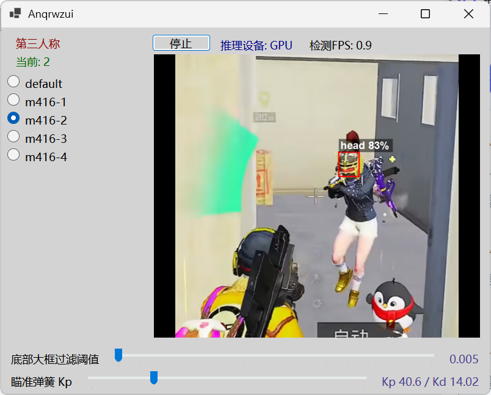

> **⚠️ 免责声明**
> 本项目仅供个人学习和研究计算机视觉、输入控制等技术之用。请遵守相关法律法规和游戏服务条款，作者不对因使用本项目产生的任何后果承担责任。
> **别用，用就封号。**

# anqrwzui

基于 YOLOv8 目标检测的屏幕感知辅助工具，采用 .NET 8.0 WinForms 实现，支持 DXGI 高性能截屏、ONNX Runtime GPU 推理、弹簧阻尼物理瞄准以及压枪补偿。



<video width="1080" controls>
  <source src="Assets/demo.mp4" type="video/mp4">
</video>

## 功能特性

- **高性能截屏**：通过 SharpDX 封装 DXGI Desktop Duplication API，在 GPU 显存中完成屏幕中心 640×640 区域的零拷贝裁剪
- **AI 目标检测**：基于 ONNX Runtime 的 YOLOv8/YOLO11 推理引擎，支持 CUDA 加速，自动回退 CPU
- **弹簧阻尼瞄准**：基于质量-弹簧-阻尼物理模型（PD 控制器），生成具有加速度和缓冲的拟人化鼠标移动轨迹
- **压枪补偿**：定时下移逻辑，混合正弦噪声和随机扰动，模拟自然手感
- **目标锁定与容错**：支持多帧目标保持（HoldFrames）和关联距离容错，避免目标丢失导致的抖动
- **人称模式切换**：支持第一/第三人称模式，右键临时切换
- **武器方案切换**：通过数字键快速切换不同武器的压枪配置
- **配置热重载**：基于 `FileSystemWatcher` 监测配置文件变化，无需重启即可生效
- **自过滤机制**：自动过滤画面底部属于玩家自身的头部检测框，滑块实时可调
- **双模鼠标模拟**：优先使用 KM04 幽灵键鼠硬件级模拟，未连接时自动退回系统 `SendInput`
- **实时预览**：UI 内置检测框绘制、FPS 计数、推理设备状态显示

## 程序依赖

| 依赖          | 版本   | 必需 | 说明                 |
| ------------- | ------ | ---- | -------------------- |
| .NET 8.0 SDK  | 8.0+   | ✅   | 构建和运行           |
| CUDA          | 12.9   | 可选 | 无则退化到 CPU 推理  |
| cuDNN         | 9.17.1 | 可选 | 配合 CUDA 使用       |
| 幽灵键鼠 KM04 | —      | 可选 | 无则退化到 SendInput |

### NuGet 包

- `Microsoft.ML.OnnxRuntime.Gpu` 1.19.2
- `SharpDX` / `SharpDX.Direct3D11` / `SharpDX.DXGI` 4.2.0

## 构建与运行

```bash
# 构建
dotnet build

# 运行
dotnet run --project anqrwzui.csproj

# 发布
dotnet publish -c Release --self-contained false -r win-x64 --project anqrwzui.csproj
```

## 使用说明

### 快捷键

| 按键            | 功能                             |
| --------------- | -------------------------------- |
| `V`             | 切换第一/第三人称模式            |
| `1` / `Numpad1` | 切换到武器方案组 1               |
| `2` / `Numpad2` | 切换到武器方案组 2               |
| `3` / `Numpad3` | 关闭压枪补偿                     |
| `Ctrl + 滚轮`   | 在当前方案组中切换选项           |
| `右键按住`      | 临时切换到第一人称模式           |
| `左键 + 右键`   | 启用压枪补偿（需先选择武器方案） |

### 运行流程

1. 启动应用程序
2. 打开目标窗口
3. 通过数字键选择武器方案
4. 按住右键瞄准时自动启用弹簧阻尼跟踪
5. 同时按住左右键时启用压枪补偿

## 配置系统

配置文件位于 `Config/config.json`，支持热重载（保存即生效）。

```json
{
  "Options": [
    ["default", 0],
    ["m416-1", 0.6],
    ["m416-2", 1],
    ["m416-3", 1.6],
    ["m416-4", 2.2]
  ],
  "Detector": {
    "SelfFilterAreaRatio": 0.018
  },
  "AimPhysics": {
    "Kp": 64.0
  },
  "AimTarget": {
    "HoldFrames": 4,
    "AssociationDistanceRatio": 0.08,
    "MaxOffsetRatio": 0.45
  }
}
```

### 字段说明

| 字段                                 | 说明                                             | 默认值 |
| ------------------------------------ | ------------------------------------------------ | ------ |
| `Options`                            | 二维数组，每行对应一个武器方案的压枪像素步进序列 | —      |
| `Detector.SelfFilterAreaRatio`       | 底部自过滤区域比例，过滤自身头部检测框           | 0.018  |
| `AimPhysics.Kp`                      | 弹簧刚度，值越大瞄准响应越快                     | 64.0   |
| `AimTarget.HoldFrames`               | 目标丢失后保持锁定的帧数                         | 4      |
| `AimTarget.AssociationDistanceRatio` | 目标关联距离比例                                 | 0.08   |
| `AimTarget.MaxOffsetRatio`           | 目标锁定的最大偏移比例                           | 0.45   |

UI 中还提供了"底部大框过滤阈值"和"瞄准弹簧 Kp"两个实时可调滑块。

## 训练模型

项目包含完整的训练管道（`YoloTrain/` 目录），从视频采集到模型部署。

### 训练依赖

```
python 3.13.9
pip install torch torchvision torchaudio --index-url https://download.pytorch.org/whl/cu129/
pip install ultralytics
Label Studio  # 可选，用于标注管理
```

### 训练流程

**1. 数据采集与帧提取**

使用 `extract.py` 从游戏录像中按步长提取 640×640 中心裁剪图片：

```bash
# 单个视频
python extract.py --video path/to/video.mp4 --stride 10

# 整个文件夹
python extract.py --video path/to/video_dir/ --stride 10
```

**2. 数据标注**

使用 Label Studio 标注头部区域，类别为 `head`。标注完成后将标签文件放入 `datasets/labels/` 对应目录。

> 可使用 `ls_convert_to_draft.py` 进行 Label Studio 标注格式转换。

**3. 开始训练**

```bash
cd YoloTrain
python train.py
```

训练参数摘要：

| 参数         | 值           | 说明              |
| ------------ | ------------ | ----------------- |
| 预训练权重   | `yolo11n.pt` | 迁移学习          |
| 图像尺寸     | 640×640      | —                 |
| Epochs       | 200          | —                 |
| Batch        | 16           | —                 |
| box 损失权重 | 10.0         | 提高定位精度      |
| Mosaic       | 关闭         | 适应稀疏目标场景  |
| 类别         | 单类 `head`  | `single_cls=True` |

**4. 模型部署**

训练完成后自动导出 ONNX 格式（FP16），将 `exp/weights/best.onnx` 复制到项目根目录的 `Model/best.onnx` 即可。

## 技术架构

```
anqrwzui/
├── Program.cs                 # 应用入口
├── Forms/
│   ├── Main.cs                # 主窗体生命周期
│   ├── Main.Fields.cs         # 状态字段与常量定义
│   ├── Main.UI.cs             # 界面构建（TableLayoutPanel）
│   ├── Main.Capture.cs        # 主循环：截屏→推理→过滤→瞄准
│   ├── Main.Config.cs         # 配置管理与热重载
│   └── Main.Input.cs          # 全局钩子、物理瞄准、压枪补偿
├── Utils/
│   ├── YoloV8Detector.cs      # ONNX Runtime 推理引擎
│   ├── DxgiScreenCapture.cs   # DXGI 桌面复制截屏
│   ├── MouseController.cs     # KM04 / SendInput 双模鼠标
│   ├── DetectionRenderer.cs   # UI 检测框绘制
│   └── Logger.cs              # 日志系统
├── Model/
│   └── best.onnx              # 训练好的 ONNX 模型
├── Libs/
│   └── gbild64.dll            # KM04 原生设备库
└── YoloTrain/                 # Python 训练管道
    ├── extract.py             # FFmpeg 帧提取
    ├── train.py               # YOLOv11 训练脚本
    └── datasets/              # 数据集与配置
```

### 核心数据流

```
DXGI 截屏 (640×640)
    ↓
YOLOv8 ONNX 推理 (CUDA/CPU)
    ↓
NMS + 单类后处理
    ↓
自过滤 (排除底部自身头部)
    ↓
目标锁定 (HoldFrames + 关联距离)
    ↓
弹簧阻尼 PD 控制器 → 鼠标移动增量
    ↓
压枪补偿 (定时下移 + 噪声扰动)
    ↓
KM04 硬件模拟 / SendInput
```

## 开发历程

### 起源：一次失败的 Rust 尝试（2026-01-11 ~ 01-14）

项目最初用 Rust 的 Iced 框架起步。`iced 0.14` 的兼容问题让我在一天之内经历了 `use iced 0.14` → `revert` → `换成 c#` 的完整循环。事实证明，对于需要大量 Windows 原生互操作（P/Invoke、全局钩子、DXGI）的场景，C# WinForms 是更务实的选择。

### 从零到一：截屏与推理（2026-01-15 ~ 01-19）

切到 C# 后，先整理了项目目录，然后用 SharpDX 实现了 DXGI 截屏。这一步比想象中顺利——Desktop Duplication API 直接在 GPU 显存中完成裁剪，延迟极低。

紧接着接入 ONNX Runtime，用 CUDA 加速跑通了第一个 YOLOv8 模型。当屏幕上第一次画出 `person` 的检测框时，整个管线就通了：截屏 → 推理 → 绘制，一气呵成。

### 赋予行动：鼠标控制（2026-01-19 ~ 01-20）

光有"眼睛"还不够，还需要"手"。通过全局鼠标钩子捕获按键状态，结合 `gbild64.dll` 的 P/Invoke 调用实现了硬件级鼠标模拟。没有 KM04 硬件时自动退回 `SendInput`，保证了基本可用性。

### 训练自己的模型（2026-01-22 ~ 01-26）

通用的 person 检测不够精确，开始训练专用模型。搭建了完整的 Python 训练管道：FFmpeg 帧提取 → Label Studio 标注 → ultralytics 训练 → ONNX 导出。专门关闭了 Mosaic 和 MixUp 增强，因为稀疏目标场景下这些增强反而有害。

### 压枪与交互（2026-01-27 ~ 01-30）

加入了压枪补偿功能——按住左右键时定时下移鼠标。为了让手感更自然，混合了正弦噪声和随机扰动。配套实现了快捷键切换武器方案、选项记忆、配置持久化等交互细节。

### 数据打磨：采集、标注与训练迭代（2026-02 ~ 04）

功能框架搭好后，进入了漫长的数据工作阶段。这段时间代码提交不多，但幕后的工作量一点不少：反复打素材录像、用 `extract.py` 按步长提取帧、在 Label Studio 里一帧帧标注头部区域、跑训练、看 mAP 和 loss 曲线、根据结果调整标注策略和训练参数，再重新标注、重新训练，如此循环。

这个过程没有太多代码层面的产出，却是整个项目最关键的阶段——模型的精度直接决定了最终效果。标注方式从粗放到精细，训练参数从默认配置逐步调优，Mosaic 和 MixUp 的关闭就是在这个阶段摸索出来的结论。

### 智能化升级（2026-05-04 ~ 05-27）

数据打磨到位后，五月开始将积累的经验固化到代码中。首先加入了自过滤机制——通过 `SelfFilterAreaRatio` 滑块过滤画面底部属于自身的头部检测框，解决了第三人称模式下总瞄自己头的问题。

随后对训练流程做了单类别优化，统一了标注格式的归一化处理。引入了人称模式状态机，区分第一/第三人称的检测策略。

最重要的改进是**弹簧阻尼瞄准系统**。摒弃了之前简单的“吸附式”瞄准，改用质量-弹簧-阻尼物理模型（PD 控制器）。通过 `Kp`（刚度）和 `Kd`（阻尼）两个参数，鼠标移动具有了加速度和缓冲，轨迹更接近真人操作。配合目标锁定机制（HoldFrames + 关联距离），即使目标短暂消失也能保持稳定的跟踪。

### 回顾

从最初的 Rust 框架尝试到最终的弹簧阻尼物理瞄准，这个项目经历了技术栈切换、架构重构和算法迭代。代码提交之间的空白期并非停歇，而是大量数据采集、标注和训练迭代的沉淀。先让功能跑通，再用数据打磨精度，最后将经验回馈到代码中——这是这个项目最核心的节奏。

## 许可

本项目为个人学习项目，仅供技术研究和学习交流使用。
